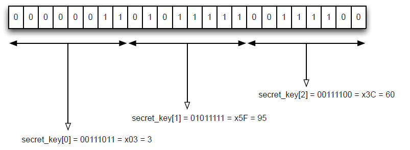

# 多核心RC4解码/破解器

# 多核心RC4解码/破解器

> 本项目背景是基于UBC CPEN 311 LAB4作业，旨在提高FPGA状态机和接口设计水平，同时提升Verilog实现算法的能力。
> 

## 背景

本章主要说明RC4编解码算法。您可以在百度/谷歌上找到相关文献，不过一下内容足以完成本项目。有趣的是，该算法同时用于信息的解码和编码，但在本项目中主要用来解码信息。

RC4是一个基于密钥的流式密码算法。通过密钥，该算法会生成一系列比特流，每个生成的比特都将和密文中的比特进行异或操作，最终结果将作为解密文档。

RC4算法以伪代码的方式呈现如下：

```jsx
//input:
//     secret_key[]: array of bytes that represent the secret key. In out implementation,
//                   we will assume a key of 24 bit, meaning this array is 3 bytes long.
//     encrypted_input[]: array of bytes that repreent the encrypted message. In out
//                        implementation, we will assume the input message is 32 bytes. 	
//output:
//     decrypted_output[]:array of bytes that represent the decrypted result. This will
//                        always be the same length as encrypted_input[].

//initialize s array.
for i = 0 to 255 {
		s[i]  =  i
}

//shuffle the array based on the secret key.
j = 0
for i = 0 to 255 {
		j = (j+s[i]+secret_key[i mod keylength]) mod 256
    swap values of s[i] and s[j]
}

//compute one byte per character in the encrypted message.
i = 0
j = 0
for k = 0 to message_length-1 {//message_length is 32 in our implementation
		i = (i+1) mod 256
		j = (j+s[i]) mod 256
		swap values of s[i] and s[j]
		f = s[(s[i]+s[j]) mod 256]
		decrypted_output[k] = f xor encrypted_input[k]// 8 bit wire XOR function
}

```

不过在本项目中，由于数据长度总共是256，所以索引寄存器i，j，k的宽度都是8bit。也就是说，所有数据都是“自动”mod 256的，因此我们大可简化算法为：

```jsx
//initialize s array. You will build this in Task 1
for i = 0 to 255 {
		j = j+s[i] + secret_key[i mod keylength] //key_length is 3 in out impl
		swap values of s[i] ans s[j]
}

//compute one byte per cahracter in the encrypted message.
i = 0
j = 0
for k = 0 to message_length-1{
		i = i + 1
		j = j + s[i]
		swap values of s[i] and s[j]
		f = s[(s[i]+s[j])]
		decrypted_output[k] = f XOR encrypted_input[k]  // 8 bit wide
}
```

相比用FPGA实现除法器，这种移位的简化方式不知道高到哪里去，大大减少了设计的复杂度和资源的占用。

通常来说，rc4加密算法使用的密钥位宽是40bit，或者8byte。在本设计中，为了减少验证时间，方便观察，密钥长度选择为3byte（24bit）。需要注意的是，在算法里面的secret_key[]代表的是一个字节（byte），而不是1位。如下图所示，密钥0x035F3C以如下数据格式储存。



同样，输入输出数据也是以byte为单位储存。我们的示例工程加密文件长度共32个字节。

## 工程设计

首先是要设计一个RC4编解码器。如下图所示，整体工程分为一下模块：

- Secret Key Generator：用于提供密钥。正常情况下，这个密钥是由用户提供的，但是在后面的破解项目中，这个模块将用于生成密钥以供破解。
- Codec FSM：用于加解密的编解码器，使用状态机实现。
- Working Memory：工作缓存，用于暂存生成的比特流，使用FPGA自带IP实现。
- Encrypted Message：提供的带解密数据，使用FPGA自带IP实现，编译前预加载需要解密的数据。
- Decrypted Message：解密出来的数据，使用FPGA自带的IP实现。


三个Memory Block配置如下：


在破解的过程中，密钥以枚举方式产生，检查生成的密码是否合理：也就是是否是ASCII定义中的文本常用编码。如果不是，则立即停止解密，更换密钥。

单个解码器设计完成后，开始考虑多个编解码器并行执行的方案。由于地址空间有24bit，而系统时钟只有50M，因此单个破解核心将等待较长时间。由此可以选择生成多个核心并行，分别解码不同的地址空间。


在上图设计中，每个FSM是一个解密核心，分别解密不同的地址空间。control模块是用于检测、收集解密结果的。一旦有任意一个核心完成解码，理科停止所有加解密，并输出结果。输出结果采用JTAG读取，使用Quartus自带的In-System Memory Content Editor读取。

